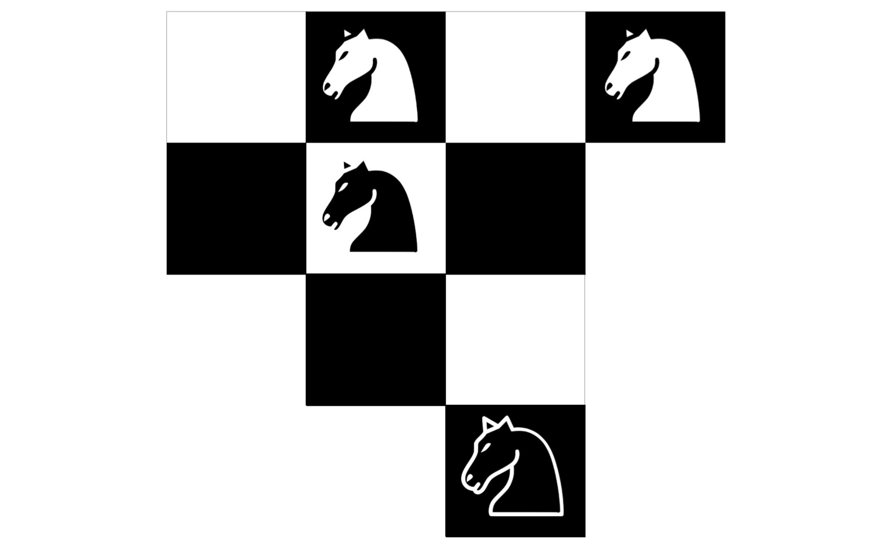
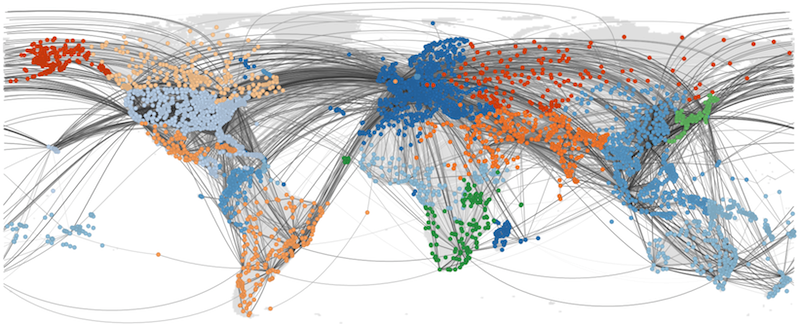
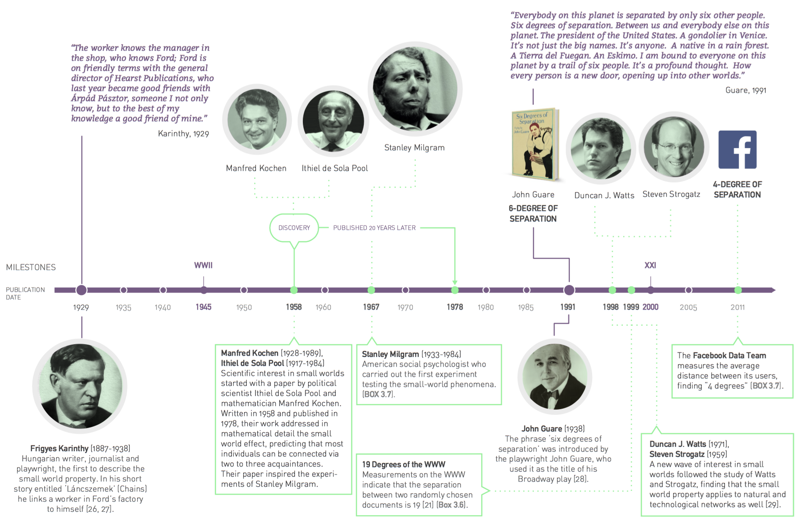
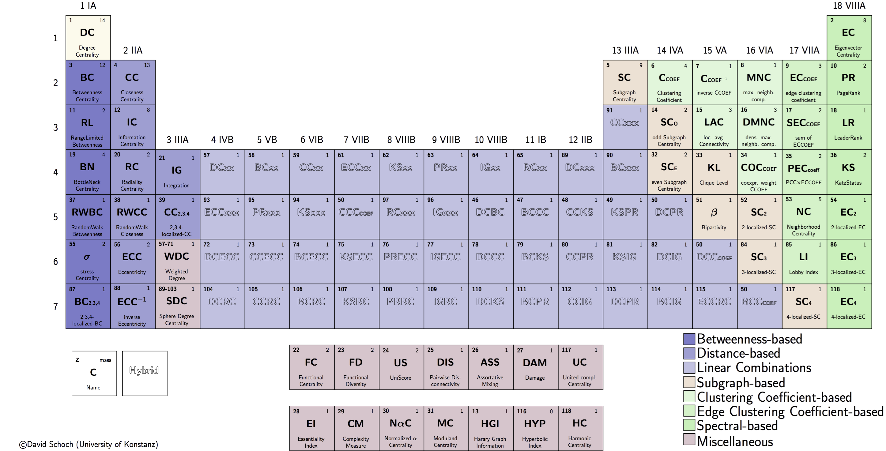
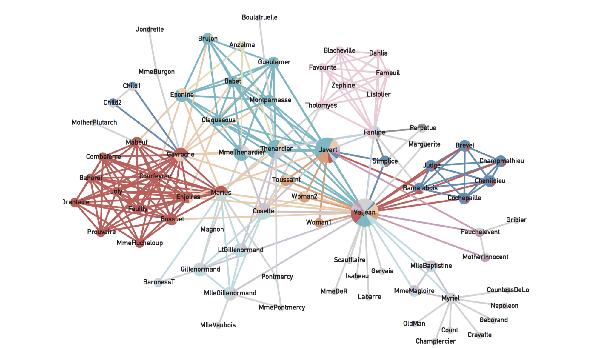

# NetPy '19: Introduction to Network Analysis in Python

###### Workshop instructor

**Asst. Prof. [Lovro Šubelj](http://lovro.lpt.fri.uni-lj.si), PhD**, University of Ljubljana

###### Workshop schedule

Thursday, **19th September 2019 at 3:30 PM** (4 hours with breaks)

###### Workshop location

**Lecture room 3 at [UL FRI](http://www.fri.uni-lj.si)**, Večna pot 113, Ljubljana, Slovenia

###### Materials and forum

+ **GitHub** repository at [**http://github.com/lovre/netpy**](http://github.com/lovre/netpy)
+ **WWW** repository at [**http://lovro.lpt.fri.uni-lj.si/netpy**](http://lovro.lpt.fri.uni-lj.si/netpy)
+ **Piazza** forum at [**http://piazza.com/fri.uni-lj.si/fall2019/netpy**](http://piazza.com/fri.uni-lj.si/fall2019/netpy)
+ **Slovenian** dictionary at [**http://lovro.lpt.fri.uni-lj.si/netpy/dict.pdf**](http://lovro.lpt.fri.uni-lj.si/netpy/dict.pdf)

###### High-level description

**The workshop is primarily aimed at Python programmers, either academics, professionals or students, that wish to learn the basics of modern network science and practical analyses of complex real networks, such as social, information and biological networks.** Familiarity with the basics of probability theory, statistics and linear algebra is strongly encouraged.
The workshop is based on the Masters level course [**Introduction to Network Analysis**](http://lovro.lpt.fri.uni-lj.si/posters/frinets.pdf) offered at University of Ljubljana, Faculty of Computer and Information Science.

###### Recommended prerequisites

**It is recommended that attendees bring a laptop with a working installation of [Python](http://www.python.org), [NetworkX](http://networkx.github.io) and [CDlib](http://cdlib.readthedocs.io) packages, and necessary dependencies. Alternatively, you can work with any other network analysis package such as [igraph](http://igraph.org), [graph-tool](http://graph-tool.skewed.de) or [SNAP.py](http://snap.stanford.edu/snappy/).** Finally, for the purposes of visualization of smaller networks, it is recommended to have a working installation of some network analysis software such as [Gephi](http://gephi.org) or [visone](http://visone.info).

###### Tentative syllabus

+ **Challenge**: Warmup Guimera's four knights challenge (10 min)

1. From classical graph theory to **modern network science** (30 min)
2. **Large-scale structure** of real networks and graph **models** (50 min)
3. Measures of **node importance** and link analysis **algorithms** (50 min)
4. Network **community**, **core-periphery** and **equivalence** structure (50 min)
5. Network-based **mining**, **visualization** and practical **applications** (50 min)

+ **Hands-on**: Abstraction, centrality, clusters, mining and visualization (~ min)

###### Networks data

All networks are available in Pajek, edge list in LNA formats.

+ [**Simple toy example network**](http://lovro.lpt.fri.uni-lj.si/netpy/toy.net) (5 nodes)
+ [**Zachary's karate club network**](http://lovro.lpt.fri.uni-lj.si/netpy/karate.net) (34 nodes)
+ [**Davis's southern women network**](http://lovro.lpt.fri.uni-lj.si/netpy/women.net) (32 nodes)
+ [**Lusseau's bottlenose dolphins network**](http://lovro.lpt.fri.uni-lj.si/netpy/dolphins.net) (62 nodes)
+ [**Game of Thrones character appearance network**](http://lovro.lpt.fri.uni-lj.si/netpy/got-appearance.net) (107 nodes)
+ [**Human diseasome network by common symptoms**](http://lovro.lpt.fri.uni-lj.si/netpy/diseasome.net) (117 nodes)
+ [**Conflicts and alliances between world nations**](http://lovro.lpt.fri.uni-lj.si/netpy/wars.net) (180 nodes)
+ [**Game of Thrones character kills network**](http://lovro.lpt.fri.uni-lj.si/netpy/got-kills.net) (284 nodes)
+ [**Ljubljana public bus transport network**](http://lovro.lpt.fri.uni-lj.si/netpy/lpp.net) (416 nodes)
+ [**US airplane traffic transport network**](http://lovro.lpt.fri.uni-lj.si/netpy/transport.net) (1,323 nodes)
+ [**Java software class dependency network**](http://lovro.lpt.fri.uni-lj.si/netpy/java.net) (1,516 nodes)
+ [**Ingredients network by common compounds**](http://lovro.lpt.fri.uni-lj.si/netpy/ingredients.net) (1,525 nodes)
+ [**Map of Darknet from Tor network**](http://lovro.lpt.fri.uni-lj.si/netpy/darknet.net) (7,178 nodes)
+ [**IMDb actors collaboration network**](http://lovro.lpt.fri.uni-lj.si/netpy/imdb.net) (17,577 nodes)
+ [**Human protein-protein interaction network**](http://lovro.lpt.fri.uni-lj.si/netpy/ppi.net) (19,634 nodes)
+ [**WikiLeaks cable reference network**](http://lovro.lpt.fri.uni-lj.si/netpy/wikileaks.net) (52,416 nodes)
+ [**Internet map of autonomous systems**](http://lovro.lpt.fri.uni-lj.si/netpy/internet.net) (75,885 nodes)
+ [**Amazon product copurchase network**](http://lovro.lpt.fri.uni-lj.si/netpy/amazon.net) (262,111 nodes)
+ [**Paper citation network of APS**](http://lovro.lpt.fri.uni-lj.si/netpy/aps.net) (438,943 nodes)
+ [**Small part of Google web graph**](http://lovro.lpt.fri.uni-lj.si/netpy/google.net) (875,713 nodes)
+ [**Road/highway network of Texas**](http://lovro.lpt.fri.uni-lj.si/netpy/texas.net) (1,379,917 nodes)

## Let's start with Guimera's four knights challenge

###### Tentative duration

**5+5 min**

###### Challenge description

To be **revealed in class** =)

## 1. Classical graph theory → modern network science

###### Tentative duration

**15+15 min**

###### Brief description

**Introduction** of networks and selected **motivational examples**. From **classical graph theory** to social network analysis and **modern network science**. Network perspectives in different **fields of science**.

###### Lecture slides

+ [**Networks introduction and motivational examples**](http://lovro.lpt.fri.uni-lj.si/netpy/intro.pdf)
+ [**Brief historical development of network science**](http://lovro.lpt.fri.uni-lj.si/netpy/history.pdf)
+ [**Network perspectives through science**](http://lovro.lpt.fri.uni-lj.si/netpy/perspects.pdf) (tentative)

###### Book chapters

+ Ch. 1: [Introduction](http://networksciencebook.com/chapter/1) in Barabási, A.-L., [_Network Science_](http://networksciencebook.com) (Cambridge University Press, 2016).
+ Ch. 1-5: Introduction etc. in Newman, M.E.J., [_Networks: An Introduction_](https://global.oup.com/academic/product/networks-9780198805090?cc=si&lang=en&) (Oxford University Press, 2010).
+ Ch. 1: [Overview](https://www.cs.cornell.edu/home/kleinber/networks-book/networks-book-ch01.pdf) in Easley, D. & Kleinberg, J., [_Networks, Crowds, and Markets_](https://www.cs.cornell.edu/home/kleinber/networks-book/) (Cambridge University Press, 2010).

###### Selected must-reads

+ Barabási, A.-L., The network takeover, _Nat. Phys._ **8**(1), 14-16 (2012).
+ Motter, A.E. & Yang, Y., The unfolding and control of network cascades, _Phys. Today_ **70**(1), 33-39 (2017).
+ Cramer, C., Porter, M.A. et al., [_Network Literacy: Essential Concepts and Core Ideas_](https://sites.google.com/a/binghamton.edu/netscied/Network-Literacy-low-res.pdf?attredirects=0) (Creative Commons Licence, 2015).

###### Selected papers

+ Newman, M.E.J., The physics of networks, _Phys. Today_ **61**(11), 33-38 (2008).
+ Cimini, G., Squartini, T. et al., [The statistical physics of real-world networks](https://arxiv.org/abs/1810.05095), _Nat. Rev. Phys._ **1**(1), 58-71 (2019).
+ Newman, M.E.J., Communities, modules and large-scale structure in networks, _Nat. Phys._ **8**(1), 25-31 (2012).
+ Vespignani, A., Modelling dynamical processes in complex socio-technical systems, _Nat. Phys._ **8**(1), 32-39 (2012).
+ Hegeman, T. & Iosup, A., [Survey of graph analysis applications](https://arxiv.org/abs/1807.00382), e-print _arXiv:180700382v1_, pp. 23 (2018).
+ Hidalgo, C.A., Disconnected, fragmented, or united? A trans-disciplinary review of network science, _Appl. Netw. Sci._ **1**, 6 (2016).

## 2. Large-scale network structure and graph models

###### Tentative duration

**30+20 min**

###### Brief description

Classical **graph theory** and modern **network analysis**. **Random graphs**, **scale-free** and **small-world** network **models**, and real network structure. **Network representations**, data formats and repositories. 

###### Lecture slides

+ [**Graph theory and modern network analysis**](http://lovro.lpt.fri.uni-lj.si/netpy/networkology.pdf)
+ [**Random graph models and network structure**](http://lovro.lpt.fri.uni-lj.si/netpy/randoms.pdf)
+ [**Scale-free and small-world network models**](http://lovro.lpt.fri.uni-lj.si/netpy/models.pdf)
+ [**Network representations, formats and data**](http://lovro.lpt.fri.uni-lj.si/netpy/represent.pdf)

###### Hands-on analysis

+ Large-scale [**network structure and random graphs**](http://lovro.lpt.fri.uni-lj.si/netpy/networks.pdf)
+ [**Starter script**](http://lovro.lpt.fri.uni-lj.si/netpy/networks-starter.py) for network structure and random graphs
+ [**Zachary's karate club network**](http://lovro.lpt.fri.uni-lj.si/netpy/karate.net) in Pajek format
+ [**Davis's southern women network**](http://lovro.lpt.fri.uni-lj.si/netpy/women.net) in Pajek format
+ [**Lusseau's bottlenose dolphins network**](http://lovro.lpt.fri.uni-lj.si/netpy/dolphins.net) in Pajek format
+ [**Ingredients network by common compounds**](http://lovro.lpt.fri.uni-lj.si/netpy/ingredients.net) in Pajek format
+ [**Map of Darknet from Tor network**](http://lovro.lpt.fri.uni-lj.si/netpy/darknet.net) in Pajek format
+ [**Human protein-protein interaction network**](http://lovro.lpt.fri.uni-lj.si/netpy/ppi.net) in Pajek format
+ [**Internet map of autonomous systems**](http://lovro.lpt.fri.uni-lj.si/netpy/internet.net) in Pajek format
+ [**Amazon product copurchase network**](http://lovro.lpt.fri.uni-lj.si/netpy/amazon.net) in Pajek format
+ [**Paper citation network of APS**](http://lovro.lpt.fri.uni-lj.si/netpy/aps.net) in Pajek format
+ [**Small part of Google web graph**](http://lovro.lpt.fri.uni-lj.si/netpy/google.net) in Pajek format
+ [**Road/highway network of Texas**](http://lovro.lpt.fri.uni-lj.si/netpy/texas.net) in Pajek format

###### Book chapters

+ Ch. 2: [Graph theory](http://networksciencebook.com/chapter/2), Ch. 3.8-3.9: [Small worlds etc.](http://networksciencebook.com/chapter/3) & Ch. 4-5: [Scale-free property etc.](http://networksciencebook.com/chapter/4) in Barabási, A.-L., Network Science (Cambridge University Press, 2016).
+ Ch. 6: Mathematics of networks & Ch. 12-15: Random graphs etc. in Newman, M.E.J., [_Networks: An Introduction_](https://global.oup.com/academic/product/networks-9780198805090?cc=si&lang=en&) (Oxford University Press, 2010).
+ Ch. 2: [Graphs](https://www.cs.cornell.edu/home/kleinber/networks-book/networks-book-ch02.pdf), Ch. 18: [Power laws etc.](https://www.cs.cornell.edu/home/kleinber/networks-book/networks-book-ch18.pdf) & Ch. 20: [Small-world phenomenon](https://www.cs.cornell.edu/home/kleinber/networks-book/networks-book-ch20.pdf) in Easley, D. & Kleinberg, J., Networks, Crowds, and Markets (Cambridge University Press, 2010).

###### Selected must-reads

+ Newman, M.E.J., Watts, D.J. & Strogatz, S.H., [Random graph models of social networks](https://www.pnas.org/content/pnas/99/suppl_1/2566.full.pdf?sid=2662d769-c2c0-48a5-afe5-6da549153812), _P. Natl. Acad. Sci. USA_ **99**, 2566-2572 (2002).
+ Ugander, J., Karrer, B. et al., [The anatomy of the Facebook social graph](https://arxiv.org/abs/1111.4503), e-print _arXiv:1111.4503v1_, pp. 17 (2011).
+ Backstrom, L., Boldi, P. et al., [Four degrees of separation](https://arxiv.org/abs/1111.4570), In: _Proceedings of WebSci '12_ (Evanston, IL, USA, 2012), pp. 45-54.

###### Selected papers

+ Erdős, P. & Rényi, A., [On random graphs I](http://ftp.math-inst.hu/~p_erdos/1959-11.pdf), _Publ. Math. Debrecen_ **6**, 290-297 (1959).
+ Milgram, S., The small world problem, Psychol. Today 1(1), 60-67 (1967). 
Granovetter, M.S., The strength of weak ties, _Am. J. Sociol._ **78**(6), 1360-1380 (1973).
+ Watts, D.J. & Strogatz, S.H., Collective dynamics of 'small-world' networks, _Nature_ **393**(6684), 440-442 (1998).
+ Barabási, A.-L. & Albert, R., Emergence of scaling in random networks, _Science_ **286**(5439), 509-512 (1999).
+ Faloutsos, M., Faloutsos, P. & Faloutsos, C., On power-law relationships of the Internet topology, _Comput. Commun. Rev._ **29**(4), 251-262 (1999).
+ Albert, R., Jeong, H. & Barabási, A.-L., Error and attack tolerance of complex networks, _Nature_ **406**(6794), 378-382 (2000).
+ Dorogovtsev, S.N. & Mendes, J.F.F., [Evolution of networks](https://arxiv.org/abs/cond-mat/0106144), _Adv. Phys._ **51**(4), 1079-1187 (2002).
+ Clauset, A., Shalizi, C.R. & Newman, M.E.J., [Power-law distributions in empirical data](https://arxiv.org/abs/0706.1062), _SIAM Rev._ **51**, 661-703 (2009).
+ De Domenico, M. & Arenas, A., [Modeling structure and resilience of the dark network](https://arxiv.org/abs/1612.01284), _Phys. Rev. E_ **95**(2), 022313 (2017).
+ Broido, A.D. & Clauset, A., [Scale-free networks are rare](https://www.nature.com/articles/s41467-019-08746-5), _Nat. Commun._ **10**(1), 1017 (2019).
+ Barabási, A.-L., [Love is all you need](https://uploads-ssl.webflow.com/58bcae2c9d6c401e73a26fed/5aa01d3e24eebb000199a0a2_loveisallyouneed.pdf), reply to e-print _arXiv:1801.03400v1_, pp. 6 (2018).
+ Holme, P., [Rare and everywhere](https://www.nature.com/articles/s41467-019-09038-8), _Nat. Commun._ **10**(1), 1016 (2019).

## 3. Measures of node importance and link analysis

###### Tentative duration

**30+20 min**

###### Brief description

**Node importance** and **measures of centrality**, i.e. clustering coefficients, spectral, closeness and betweenness centrality, and link analysis algorithms. **Link importance** and **measures of bridging**, i.e. betweenness centrality, embeddedness and topological overlap.

###### Lecture slides

+ [**Node importance and measures of centrality**](http://lovro.lpt.fri.uni-lj.si/netpy/centrality.pdf)
+ [**Link analysis for web page importance**](http://lovro.lpt.fri.uni-lj.si/netpy/analysis.pdf) (tentative)
+ [**Link importance and measures of bridging**](http://lovro.lpt.fri.uni-lj.si/netpy/bridging.pdf) (tentative)

###### Hands-on analysis

+ [**Node importance**](http://lovro.lpt.fri.uni-lj.si/netpy/position.pdf) in IMDb actors collaboration network
+ [**Starter script**](http://lovro.lpt.fri.uni-lj.si/netpy/position-starter.py) for IMDb actors collaboration network
+ [**IMDb actors collaboration network**](http://lovro.lpt.fri.uni-lj.si/netpy/imdb.net) in Pajek format

###### Book chapters

+ Ch. 7: Measures and metrics in Newman, M.E.J., [_Networks: An Introduction_](https://global.oup.com/academic/product/networks-9780198805090?cc=si&lang=en&) (Oxford University Press, 2010).
+ Ch. 14: [Link analysis and Web search](https://www.cs.cornell.edu/home/kleinber/networks-book/networks-book-ch14.pdf) in Easley, D. & Kleinberg, J., [_Networks, Crowds, and Markets_](https://www.cs.cornell.edu/home/kleinber/networks-book/) (Cambridge University Press, 2010).
+ Ch. 14-15: Classical node centrality etc. in Estrada, E. & Knight, P.A., [_A First Course in Network Theory_](https://global.oup.com/academic/product/a-first-course-in-network-theory-9780198726463?cc=si&lang=en&) (Oxford University Press, 2015).

###### Selected must-reads

+ Jeong, H., Mason, S.P. et al., Lethality and centrality in protein networks, _Nature_ **411**, 41-42 (2001).
+ Jensen, P., Morini, M. et al., [Detecting global bridges in networks](https://arxiv.org/abs/1509.08295), _J. Complex Netw._ **4**(3), 319-329 (2015).
+ Tong, H., Faloutsos, C. & Pan, J.-Y., Fast random walk with restart and its applications, In: _Proceedings of ICDM ’06_ (Washington, DC, USA, 2006), pp. 613-622.

###### Selected papers

+ Freeman, L., A set of measures of centrality based on betweenness, _Sociometry_ **40**(1), 35-41 (1977).
+ Bonacich, P., Power and centrality: A family of measures, _Am. J. Sociology_ **92**(5), 1170-1182 (1987).
+ Kleinberg, J., Authoritative sources in a hyperlinked environment, _J. ACM_ **46**(5), 604-632 (1999).
+ Franceschet, M. & Bozzo, E., [A theory on power in networks](https://arxiv.org/abs/1510.08332), e-print _arXiv:1510.08332v2_, pp. 19 (2016).
+ Everett, M.G. & Valente, T.W., Bridging, brokerage and betweenness, _Soc. Networks_ **44**, 202-208 (2016).
+ Berkhin, P., A survey on PageRank computing, _Internet Math._ **2**(1), 73-120 (2005).

## 4. Clusters of nodes and network mesoscopic structure

###### Tentative duration

**30+20 min**

###### Brief description

Network **community**, **core-periphery** and other **mesoscopic** structures. Graph **partitioning**, community **detection**, **blockmodeling**, stochastic block models and core-periphery detection.

###### Lecture slides

+ [**Node clustering and community structure**](http://lovro.lpt.fri.uni-lj.si/netpy/community.pdf)
+ [**Graph partitioning and community detection**](http://lovro.lpt.fri.uni-lj.si/netpy/clustering.pdf)
+ [**Blockmodeling and block models**](http://lovro.lpt.fri.uni-lj.si/netpy/blockmodeling.pdf) (tentative)
+ [**Core-periphery structure and decomposition**](http://lovro.lpt.fri.uni-lj.si/netpy/cores.pdf) 

###### Hands-on analysis

+ [**Community and $k$-cores detection**](http://lovro.lpt.fri.uni-lj.si/netpy/clusters.pdf) of real networks
+ [**Starter script**](http://lovro.lpt.fri.uni-lj.si/netpy/clusters-starter.py) for community and $k$-cores detection
+ [**Zachary's karate club network**](http://lovro.lpt.fri.uni-lj.si/netpy/karate.net) in Pajek format
+ [**Davis's southern women network**](http://lovro.lpt.fri.uni-lj.si/netpy/women.net) in Pajek format
+ [**Lusseau's bottlenose dolphins network**](http://lovro.lpt.fri.uni-lj.si/netpy/dolphins.net) in Pajek format
+ [**Game of Thrones character appearance network**](http://lovro.lpt.fri.uni-lj.si/netpy/got-appearance.net) in Pajek format
+ [**Human diseasome network by common symptoms**](http://lovro.lpt.fri.uni-lj.si/netpy/diseasome.net) in Pajek format
+ [**Conflicts and alliances between world nations**](http://lovro.lpt.fri.uni-lj.si/netpy/wars.net) in Pajek format
+ [**US airplane traffic transport network**](http://lovro.lpt.fri.uni-lj.si/netpy/transport.net) in Pajek format
+ [**Java software class dependency network**](http://lovro.lpt.fri.uni-lj.si/netpy/java.net) in Pajek format
+ [**IMDb actors collaboration network**](http://lovro.lpt.fri.uni-lj.si/netpy/imdb.net) in Pajek format
+ [**WikiLeaks cable reference network**](http://lovro.lpt.fri.uni-lj.si/netpy/wikileaks.net) in Pajek format

###### Book chapters

+ Ch. 9: [Communities](http://networksciencebook.com/chapter/9) in Barabási, A.-L., [_Network Science_](http://networksciencebook.com) (Cambridge University Press, 2016).
+ Ch. 7.12-7.13: Homophily etc. & Ch. 11: Graph partitioning in Newman, M.E.J., [_Networks: An Introduction_](https://global.oup.com/academic/product/networks-9780198805090?cc=si&lang=en&) (Oxford University Press, 2010).
+ Ch. 21: Communities in networks in Estrada, E. & Knight, P.A., [_A First Course in Network Theory_](https://global.oup.com/academic/product/a-first-course-in-network-theory-9780198726463?cc=si&lang=en&) (Oxford University Press, 2015).
+ Ch. 3: [Strong and weak ties](https://www.cs.cornell.edu/home/kleinber/networks-book/networks-book-ch03.pdf) in Easley, D. & Kleinberg, J., [_Networks, Crowds, and Markets_](https://www.cs.cornell.edu/home/kleinber/networks-book/) (Cambridge University Press, 2010).

###### Selected must-reads

+ Hric, D., Darst, R.K. & Fortunato, S., [Community detection in networks: Structural communities versus ground truth](https://arxiv.org/abs/1406.0146), _Phys. Rev. E_ **90**(6), 062805 (2014).
+ Fortunato, S. & Hric, D., [Community detection in networks: A user guide](https://arxiv.org/abs/1608.00163), _Phys. Rep._ **659**, 1-44 (2016).
+ Schaub, M.T., Delvenne, J.-C. et al., [The many facets of community detection in complex networks](https://arxiv.org/abs/1611.07769), _Appl. Netw. Sci._ **2**, 4 (2017).
+ Rossetti, G., Milli, L., & Cazabet, R., [CDlib: A python library to extract, compare and evaluate communities from complex networks](https://link.springer.com/article/10.1007/s41109-019-0165-9), _Appl. Netw. Sci._ **4**(1), 1–26 (2019).

###### Selected papers

+ Granovetter, M.S., The strength of weak ties, _Am. J. Sociol._ **78**(6), 1360-1380 (1973).
+ Girvan, M. & Newman, M.E.J., [Community structure in social and biological networks](https://arxiv.org/abs/cond-mat/0112110), _P. Natl. Acad. Sci. USA_ **99**(12), 7821-7826 (2002).
+ Fortunato, S., [Community detection in graphs](https://arxiv.org/abs/0906.0612), _Phys. Rep._ **486**(3-5), 75-174 (2010).
+ Leskovec, J., Lang, K.J. et al., [Community structure in large networks](https://arxiv.org/abs/0810.1355), _Internet Math._ **6**(1), 29–123 (2009).
+ Borgatti, S.P. & Everett, M.G., Models of core/periphery structures, _Soc. Networks_ **21**(4), 375–395 (2000).
+ Holme, P., [Core-periphery organization of complex networks](https://arxiv.org/abs/physics/0506035), _Phys. Rev. E_ **72**(4), 46111 (2005).
+ Newman, M.E.J. & Leicht, E.A., [Mixture models and exploratory analysis in networks](https://arxiv.org/abs/physics/0611158), _P. Natl. Acad. Sci. USA_ **104**(23), 9564 (2007).
+ Raghavan, U.N., Albert, R. & Kumara, S., [Near linear time algorithm to detect community structures in large-scale networks](https://arxiv.org/abs/0709.2938), _Phys. Rev. E_ **76**(3), 036106 (2007).
+ Rosvall, M. & Bergstrom, C.T., Maps of random walks on complex networks reveal community structure, _P. Natl. Acad. Sci. USA_ **105**(4), 1118-1123 (2008).
+ Blondel, V.D., Guillaume, J.-L. et al., [Fast unfolding of communities in large networks](https://arxiv.org/abs/0803.0476), _J. Stat. Mech._, P10008 (2008).
+ Traag, V.A., Waltman, L. & Van Eck, N.J., [From Louvain to Leiden: Guaranteeing well-connected communities](https://www.nature.com/articles/s41598-019-41695-z), _Sci. Rep._ **9**, 5233 (2019).
+ Peixoto, T.P., [Bayesian stochastic blockmodeling](http://arxiv.org/abs/1705.10225), e-print _arXiv:170510225v7_, pp. 44 (2018).

## 5. Network-based mining, visualization and applications

###### Tentative duration

**30+20 min**

###### Brief description

TODO

###### Lecture slides

TODO

###### Hands-on analysis

TODO

###### Selected must-reads

TODO

###### Selected papers

TODO